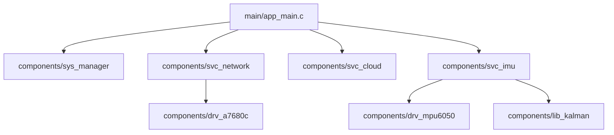

# 📋 FIRMWARE DEVELOPMENT INSTRUCTIONS v2.0
# Wearable HAR & Post-Impact Fall Detection System
> **Mục đích**: Tài liệu đặc tả kỹ thuật và hướng dẫn phát triển hệ thống firmware v2 dành cho các AI Agent và lập trình viên.
> **Cập nhật cuối (Timestamp)**: 2026-05-21T15:07:00+07:00
> **Tác giả**: Antigravity AI Assistant

---

## 1. TỔNG QUAN HỆ THỐNG
Hệ thống firmware được xây dựng trên dòng chip **ESP32-S3-N16R8** nhằm mục tiêu giám sát vận động, đếm bước chân (HAR) và phát hiện té ngã (Post-Impact Fall Detection).

### 1.1 Hai Giai Đoạn Phát Triển (Phase Roadmap)
*   **Phase 1 (Data Collection)**: Firmware cấu hình cảm biến IMU đọc ở tần số **100Hz**, thực hiện lọc Kalman và gom nhóm dữ liệu (Batching Mode) để truyền lên server (qua WiFi/MQTT) phục vụ việc huấn luyện mô hình học máy (TinyML).
*   **Phase 2 (TinyML Deployment & 4G)**: Triển khai trực tiếp mô hình TinyML lượng tử hóa (Quantized Model) lên ESP32-S3 để suy luận (inference) trực tiếp trên thiết bị (on-device). Khi phát hiện té ngã hoặc thay đổi trạng thái, thông báo sẽ được gửi qua **4G LTE (A7680C)** về hệ thống cloud.

---

## 2. PHẦN CỨNG & CẤU HÌNH PHẦN CỨNG BẮT BUỘC
*   **MCU**: Seeed Studio XIAO ESP32S3 (8MB Flash, 8MB PSRAM).
*   **IMU Sensor**: MPU6050 (kết nối I2C @ 400kHz).
*   **4G LTE**: A7680C (giao tiếp qua UART, điều khiển chân Reset GPIO 18).
*   **Vị trí đeo thiết bị**: Thắt lưng phía trước.
*   **Hệ tọa độ Body Frame (FLU Convention)**:
    *   `sensor.az` ➔ `X_body` (Sang ngang - Left)
    *   `sensor.ax` ➔ `Y_body` (Lên trời - UP, chịu lực hút trái đất ~1g ở trạng thái tĩnh)
    *   `sensor.ay` ➔ `Z_body` (Hướng tiến - Forward)
    *   `sensor.gz` ➔ `Roll rate`
    *   `sensor.gx` ➔ `Pitch rate`

---

## 3. KIẾN TRÚC PHẦN MỀM THỰC TẾ (COMPONENTS)
Firmware được phân rã thành các thư viện thành phần (components) rõ ràng trong thư mục `components/`:

### 3.1 Danh Sách Các Component
1.  **`sys_manager`**: Quản lý máy trạng thái hữu hạn (FSM) trung tâm và phân phối sự kiện (Event Loop).
2.  **`svc_network`**: Dịch vụ mạng vật lý, chuyên trách quản lý kết nối WiFi STA (Phase 1) và tự động khôi phục kết nối (Phase 2 sẽ mở rộng tích hợp LTE).
3.  **`svc_cloud`**: Dịch vụ đám mây (Application Layer), quản lý vòng đời MQTT Client, xử lý lệnh từ xa và định tuyến bản tin.
4.  **`svc_imu`**: Dịch vụ xử lý dữ liệu IMU (Đọc dữ liệu từ FIFO, áp dụng bộ lọc Kalman, cập nhật Sliding Window và gửi event).
5.  **`drv_mpu6050`**: Driver điều khiển phần cứng MPU6050 thông qua I2C.
6.  **`lib_kalman`**: Bộ lọc Kalman 1D để khử nhiễu góc nghiêng (Roll/Pitch).
7.  **`drv_a7680c`**: Driver phần cứng điều khiển và Reset module 4G LTE A7680C.

### 3.2 Cơ Chế Giao Tiếp Giữa Các Thành Phần (Inter-Component Communication)

Để tối ưu hóa luồng dữ liệu và tránh quá tải hệ thống, firmware tuân thủ chặt chẽ hai cơ chế truyền tin chính:

1. **System Event Loop (esp_event) - Điều hướng trạng thái điều khiển**:
   - Sử dụng để gửi và nhận các bản tin dạng control signals, trạng thái FSM (ví dụ: `SYS_EVENT`, `NET_EVENT`, `CLOUD_EVENT`).
   - Các bản tin này có kích thước payload rất nhỏ và tần suất thấp.
   - **Cấm** gửi các bản tin chứa mảng dữ liệu thô dung lượng lớn qua System Event Loop để tránh gây nghẽn luồng xử lý chính của hệ thống.

2. **FreeRTOS Message Queue (xQueue) - Luồng truyền tải dữ liệu nặng**:
   - Sử dụng riêng `s_imu_queue` (chứa các gói `imu_batch_data_t` kích thước ~602 bytes) để truyền dữ liệu trực tiếp từ `svc_imu` sang `svc_cloud` mà không qua trung gian Event Loop.
   - Task `svc_cloud_task` hoạt động độc lập làm nhiệm vụ lấy dữ liệu từ queue, tiến hành mã hóa Base64 và đóng gói cJSON rồi truyền lên MQTT Broker, giúp giải phóng hoàn toàn bộ nhớ stack và CPU cho các tiến trình khác.
   - **Đặc biệt (Tránh Circular Dependency trong CMake)**: Để `svc_cloud` có thể sử dụng các struct dữ liệu từ `svc_imu` (phụ thuộc một chiều: `svc_cloud` -> `svc_imu`), ta tránh để `svc_imu` include `svc_cloud.h` ngược lại. Thay vào đó, `svc_imu` cung cấp hàm đăng ký callback: `imu_service_register_batch_callback(imu_batch_callback_t cb)`. `app_main.c` sẽ là nơi đăng ký hàm `svc_cloud_enqueue_imu_batch` làm callback cho `svc_imu` khi hệ thống khởi động. Điều này giúp kiến trúc hoàn toàn modular và sạch sẽ!

3. **Cơ chế Watchdog & Phục Hồi Phần Cứng (MPU6050 Recovery)**:
   - Task IMU (`imu_processing_task`) chờ ngắt từ PCNT bằng hàm `ulTaskNotifyTake` cấu hình timeout **1000ms** thay vì chờ vô hạn (`portMAX_DELAY`).
   - Nếu xảy ra lỗi vật lý làm tràn bộ đệm FIFO của cảm biến hoặc kẹt chân ngắt (INT pin), task sẽ tự động phát hiện timeout, phát lệnh `mpu6050_reset_fifo()` và làm sạch PCNT qua `pcnt_unit_clear_count()`, giúp hệ thống tự phục hồi mà không bị treo vĩnh viễn.

---

## 4. MÁY TRẠNG THÁI HỆ THỐNG TRUNG TÂM (CENTRAL FSM)
Hệ thống sử dụng một máy trạng thái hữu hạn (Finite State Machine) làm hạt nhân điều hành, phối hợp các service thông qua ESP Event Loop.

### 4.1 Danh Sách Các Trạng Thái (System States)
*   **`STATE_INIT`**: Hệ thống đang khởi tạo phần cứng, NVS, I2C, bộ lọc và các biến toàn cục.
*   **`STATE_CONNECTING`**: Đang cố gắng kết nối mạng (WiFi hoặc Cellular 4G) và kết nối tới MQTT Broker.
*   **`STATE_NORMAL`**: Hoạt động bình thường. Đang đọc IMU, giám sát cử động cục bộ nhưng **không** truyền dữ liệu thô (raw data) lên mạng liên tục nhằm tiết kiệm pin.
*   **`STATE_STREAMING`**: Chế độ thu thập dữ liệu thô (Phase 1). Truyền liên tục dữ liệu IMU 100Hz qua MQTT phục vụ train AI.
*   **`STATE_OTA`**: Đang cập nhật firmware từ xa qua mạng.
*   **`STATE_ERROR`**: Hệ thống gặp sự cố nghiêm trọng (Lỗi I2C sensor, mất kết nối quá lâu, tràn bộ đệm).

### 4.2 Các Cơ Sở Sự Kiện (Event Bases)
*   `SYS_EVENT`: Các sự kiện hệ thống chung (`SYS_EVT_READY`, `SYS_EVT_ENTER_STREAM_MODE`, `SYS_EVT_ENTER_NORMAL_MODE`).
*   `NET_EVENT`: Sự kiện về tầng vật lý kết nối (`NET_EVT_WIFI_CONNECTED`, `NET_EVT_CELLULAR_CONNECTED`, `NET_EVT_DISCONNECTED`).
*   `CLOUD_EVENT`: Sự kiện từ tầng ứng dụng đám mây (`CLOUD_EVT_MQTT_CONNECTED`, `CLOUD_CMD_START_STREAM`, `CLOUD_CMD_STOP_STREAM`).
*   `IMU_EVENT`: Sự kiện từ cảm biến chuyển động (`IMU_EVT_BATCH_READY`, `IMU_EVT_WINDOW_READY`).
*   `AI_EVENT`: Sự kiện từ tầng suy luận học máy cục bộ (`AI_EVT_FALL_DETECTED`).

---

## 5. QUY TẮC PHÁT TRIỂN & CODING CONVENTIONS
1.  **Ngôn ngữ**: C11 thuần. Tuyệt đối không dùng C++ trừ khi có thư viện TinyML bắt buộc.
2.  **Framework**: ESP-IDF v5.x native API. Nghiêm cấm dùng Arduino core APIs.
3.  **Tên Hàm & File**: Đặt tên có tiền tố chỉ component rõ ràng (ví dụ `sys_manager_init()`, `wifi_mqtt_publish()`).
4.  **Hệ Thống Log**: Dùng `ESP_LOGI`, `ESP_LOGE`, `ESP_LOGW`, `ESP_LOGD` với TAG tương ứng của mỗi file.
5.  **ISR Handling**: Các ngắt (ISR) vật lý phải giữ cực kỳ ngắn gọn (chỉ gửi tín hiệu notify / gửi queue bằng API `FromISR`), chuyển mọi tác vụ xử lý tính toán nặng sang các FreeRTOS Tasks.
6.  **Đơn vị chuẩn**:
    *   Gia tốc: **g** (1g ≈ 9.81 m/s²)
    *   Vận tốc góc: **°/s** (dps)
    *   Góc nghiêng: **°** (độ), phạm vi [-180, 180]
    *   Thời gian: **ms** cho delay, **s** cho biến chu kỳ `dt`

---

## 6. KHẮC PHỤC SỰ CỐ & NỢ KỸ THUẬT (KNOWN ISSUES)
*   **Gimbal Lock**: Bộ lọc Kalman góc đơn bị bất ổn định khi góc nghiêng đạt sát ±90°. Trong Phase 1 xử lý tạm thời bằng cách tăng hệ số đo lường nhiễu (`R_measure`) và đặt ngưỡng bảo vệ.
*   **PSRAM & Buffer**: Cần cấu hình và tận dụng PSRAM thông qua `MALLOC_CAP_SPIRAM` để chứa sliding window lớn hơn cho TinyML Phase 2.
*   **Raw Data Mode**: Trong Phase 1, luồng truyền raw data phải gửi dữ liệu ở dạng Batch (50 samples/mảng JSON) để giảm tải cho MQTT Broker thay vì truyền từng sample đơn lẻ ở tần suất 100Hz.

---
> **Tài liệu tham chiếu**: Đã tích hợp đồng bộ với đặc tả cụ thể của từng component con trong thư mục `components`. Mọi chỉnh sửa kiến trúc phải được cập nhật kèm mác timestamp rõ ràng.
